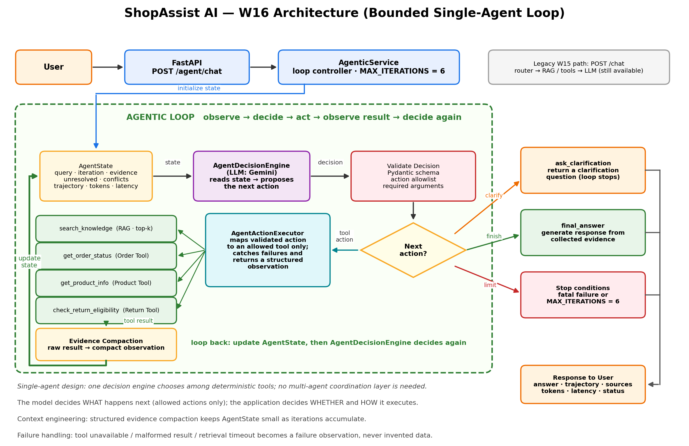

<!-- W16-SECTION -->
# ShopAssist AI — W16: Agentic Support Assistant

W16 extends the W15 assistant with a bounded agentic loop. The W15 `POST /chat` pipeline is unchanged; the new feature is served by `POST /agent/chat`.



Further detail: [`docs/W16_AGENT_DESIGN.md`](docs/W16_AGENT_DESIGN.md) and [`docs/W16_ARCHITECTURE.md`](docs/W16_ARCHITECTURE.md).

## Agentic Feature

**Cross-source verification.** The agent answers queries that need order data, product data, return eligibility and policy knowledge, choosing each next action from what it has already observed. Actions: `get_order_status`, `get_product_info`, `check_return_eligibility`, `search_knowledge`, `ask_clarification`, `final_answer`.

**Why a fixed pipeline is not enough:** a fixed pipeline must choose its sources before seeing any result, but whether to search the return policy, call another tool or ask the user for a missing ID depends on what the previous step returned.

**Loop and stopping conditions:** the loop can run several iterations per request and ends on `final_answer`, `ask_clarification`, a fatal failure, or `MAX_ITERATIONS = 6`. The application enforces the limit, not the model.

Example request:

```powershell
Invoke-RestMethod -Uri http://localhost:8002/agent/chat -Method Post -ContentType "application/json" -Body '{"message":"Can I return ORD-1003, and what does the return policy say?"}'
```

The response contains the answer plus the action trajectory, token usage, latency and final status.

## a. Context Engineering Technique

**Technique:** structured evidence compaction, with retrieval results capped to a small top-k before they are compacted.

**Where it is applied:** after every executed action, in `backend/agents/evidence.py`, before the result is written into `AgentState`. The decision engine never sees raw tool output.

**Problem it solves:** a raw order record carries many fields the next decision does not need (customer, items, address, internal metadata), and retrieval returns text passages. Appending those raw outputs on every iteration would make the prompt grow with each of up to six steps, spend tokens on irrelevant fields, and expose data the model has no reason to see. Compaction keeps only the facts and sources needed for later decisions (for example `order_id`, `status`, `sources: ["orders.json"]`).

## b. Agentic Pattern

**Single-agent loop.** The task is sequential evidence gathering where each step depends on the previous result, so there is nothing to run in parallel. All steps use the same evidence, so separate agents would gain no context isolation. The specialised work is done by deterministic tools, not by separate reasoning roles, so specialization gives no benefit either.

Against the five structural failures:
- **Context saturation:** avoided, because one compact `AgentState` holds the evidence instead of several overlapping agent contexts.
- **Sequential bottleneck:** multiple agents would add hand-offs along a chain that is already sequential.
- **Skill dilution:** not a risk, because the domain is a single narrow support task.
- **Self-verification paradox:** avoided, because tool results are deterministic and authoritative rather than one agent re-checking another's claims.
- **Single point of failure:** accepted, since there is one decision engine. It is mitigated by schema validation, an action allowlist, the iteration cap and safe failure handling.

## c. Evaluation Harness

Built from scratch in `eval/` (no evaluation framework). It runs 10 cases through the real `AgenticService`, executor, evidence compaction and tools, with decisions supplied by a deterministic mock provider so results do not depend on Gemini quota. It therefore tests the loop mechanics and failure handling, not live Gemini decision quality.

| Metric | Result |
| --- | --- |
| Total cases | 10 |
| Task completion rate | 100% |
| Tool-call correctness | 80% |
| Argument correctness | 80% |
| Average trajectory length | 2.1 |
| Average tool calls | 1.1 |
| Average tokens per query | 1976.3 |
| Average latency | 202.9877 ms |
| Hard / soft / cascading soft failures | 0 / 0 / 0 |

**Failure log (complete from the eval output):** list each case that missed the expected tool or arguments, with its classification (hard, soft or cascading soft) and the reason.

Run the harness from the project root with the virtual environment active (see `eval/`). Run the automated tests with `pytest -q`.

## Additional Requirements

**1. Skill vs Agent.** A Skill could hold the instructions for looking up an order or product, but it cannot decide mid-task whether the next step is a policy search, another tool or a clarification question, so the decision loop is an agent and the individual lookups stay deterministic tools.

**2. Token and cost accounting.** `AgentState` records `total_tokens`, and each trajectory step records the tokens it used. The harness reports tokens per query, so the extra cost of additional iterations is visible: a one-step query needs one decision, a multi-step query needs one per action. There is no multi-agent system, so there is no multi-agent comparison.

**3. Failure injection.** Three failures are injected and covered by the automated tests:
- *Order tool unavailable:* the exception is caught by the executor and recorded as a structured failure observation. No order data is invented, and the answer says the order status could not be verified.
- *Malformed tool response:* the unexpected structure is not treated as evidence. The agent gives a safe answer with no invented product details.
- *Retrieval timeout:* the timeout is recorded as a failure observation. No policy text is invented, and the answer says the policy could not be verified.

**4. Tool vs Agent boundary.** The knowledge retrieval layer is internally multi-step (query embedding, similarity search, top-k selection), but it is modeled as one bounded tool call, `search_knowledge`, that returns compact evidence or a single structured failure. It needs no independent decisions or shared state with the agent, so an agent-to-agent interaction would add coordination cost and failure modes without benefit. The transactional tools are modeled the same way.

---
# ShopAssist AI

> AI-powered customer-support assistant combining LLMs, hybrid intent routing, specialized agents, RAG, tool calling, caching, deterministic fallbacks, FastAPI, Streamlit, and Docker.

**Architecture diagram:** `docs/architecture.png`

---

## Table of Contents

1. [Project Overview](#project-overview)
2. [Problem Statement](#problem-statement)
3. [Objectives](#objectives)
4. [Key Features](#key-features)
5. [System Architecture](#system-architecture)
6. [Architecture Components](#architecture-components)
7. [Task 1 - Build an AI Assistant](#task-1---build-an-ai-assistant)
8. [LLM Integration](#llm-integration)
9. [Prompt Engineering](#prompt-engineering)
10. [Structured Output](#structured-output)
11. [Intent Routing](#intent-routing)
12. [Specialized Agents](#specialized-agents)
13. [Tool Calling](#tool-calling)
14. [RAG Pipeline](#rag-pipeline)
15. [Document Ingestion and Chunking](#document-ingestion-and-chunking)
16. [Embeddings and Retrieval](#embeddings-and-retrieval)
17. [Local LLM Deployment](#local-llm-deployment)
18. [Task 2 - Productionization](#task-2---productionization)
19. [Web UI](#web-ui)
20. [Backend API](#backend-api)
21. [Caching](#caching)
22. [Reliability](#reliability)
23. [Fallback Strategy](#fallback-strategy)
24. [Rate-Limit Handling](#rate-limit-handling)
25. [Error Handling](#error-handling)
26. [Performance Engineering](#performance-engineering)
27. [Dockerization](#dockerization)
28. [Docker Compose](#docker-compose)
29. [Configuration](#configuration)
30. [Project Structure](#project-structure)
31. [Installation](#installation)
32. [Running the Application](#running-the-application)
33. [Backend Health Check](#backend-health-check)
34. [API Usage](#api-usage)
35. [Example Requests](#example-requests)
36. [Testing](#testing)
37. [Assignment Requirement Mapping](#assignment-requirement-mapping)
38. [Deliverables](#deliverables)
39. [ONNX Consideration](#onnx-consideration)
40. [Cloud Deployment](#cloud-deployment)
41. [Security Considerations](#security-considerations)
42. [Future Improvements](#future-improvements)
43. [Conclusion](#conclusion)
44. [Created By](#created-by)

---

# Project Overview

ShopAssist AI is an AI-powered customer-support assistant designed for an e-commerce environment.

The system automatically determines the customer's intent, routes the request to an appropriate specialized support agent, retrieves relevant knowledge, invokes transactional tools when required, and generates a concise customer-facing response.

The application is designed around production-oriented AI engineering principles.

The implementation combines:

* Large Language Model integration
* Gemini API
* Prompt engineering
* Structured JSON output
* Hybrid intent routing
* Specialized support agents
* Tool calling
* Mock transactional data
* Retrieval-Augmented Generation
* Embeddings
* Semantic retrieval
* Prompt/response caching
* Deterministic fallbacks
* Rate-limit handling
* Error handling
* FastAPI
* Streamlit
* Docker
* Docker Compose
* Optional local LLM deployment through vLLM

---

# Problem Statement

Modern e-commerce platforms receive large numbers of customer-support requests.

Typical requests include:

* Order status
* Shipping information
* Returns
* Refunds
* Order cancellations
* Payment problems
* Account issues
* Product information
* General support

A conventional rule-based chatbot can handle simple requests but becomes difficult to maintain as the number of intents and business rules increases.

ShopAssist AI addresses this problem using an AI-driven routing and orchestration architecture.

The system combines LLM-based classification with deterministic fallback logic so that support functionality remains available even when the primary LLM provider is unavailable or rate-limited.

---

# Objectives

The project has two main objectives.

## Task 1

Build an AI assistant using modern LLM and RAG techniques.

The implementation covers:

* LLM integration
* Prompt engineering
* Structured output
* Intent classification
* Tool calling
* RAG
* Embeddings
* Retrieval
* Local LLM serving architecture
* Containerization

## Task 2

Productionize the AI assistant.

The implementation covers:

* Web UI
* Backend API
* Docker deployment
* Docker Compose
* Caching
* Error handling
* Rate-limit handling
* Fallback mechanisms
* Graceful degradation
* Performance considerations
* Deployment instructions

---

# Key Features

## Intelligent Intent Routing

The system classifies customer messages into:

```text
order_support
shipping
returns
refunds
cancellations
payments
account_support
product_information
general_support
```

---

## Hybrid Routing

Gemini is used as the primary intent classifier.

If Gemini is unavailable, rate-limited, or produces invalid output, the system automatically uses deterministic keyword-based routing.

This provides a reliable fallback path.

---

## Specialized Agents

Each detected intent is associated with specialized instructions.

This allows different support categories to follow different response requirements.

---

## Tool Calling

Transactional requests can invoke tools against mock e-commerce data.

Implemented tools include:

```text
get_order_status
get_product_info
check_return_eligibility
```

---

## RAG

Relevant knowledge-base information is retrieved before response generation.

The retrieved context is provided to the model so that responses can be grounded in available documentation.

---

## Structured Responses

The backend returns structured JSON containing fields such as:

```json
{
  "intent": "order_support",
  "answer": "Your order ORD-1002 is currently processing.",
  "confidence": 0.95,
  "sources": [],
  "tool_used": "get_order_status",
  "routing_method": "deterministic_fallback",
  "generation_method": "deterministic_fallback"
}
```

---

## Caching

Repeated requests can use cached responses to reduce unnecessary model calls and improve response latency.

---

## Graceful Degradation

When Gemini reaches its API quota, the application does not crash.

Instead:

```text
Gemini unavailable
       |
       v
Deterministic routing
       |
       v
Deterministic response
       |
       v
Successful API response
```

---

# System Architecture

The complete architecture diagram is available at:

```text
docs/architecture.png
```

The diagram represents the implemented ShopAssist AI architecture, including:

* Streamlit frontend
* FastAPI backend
* Chat service
* Hybrid intent router
* Specialized agents
* Gemini provider
* RAG retrieval
* Embeddings
* Knowledge base
* Transactional tools
* Mock order/product data
* Caching
* Deterministic fallback
* Docker Compose
* Optional local vLLM deployment

---

# High-Level Architecture

```text
                         SHOPASSIST AI
                              |
                              v
                    +-------------------+
                    |   Streamlit UI    |
                    +---------+---------+
                              |
                              | HTTP POST /chat
                              v
                    +-------------------+
                    |    FastAPI API    |
                    +---------+---------+
                              |
                              v
                    +-------------------+
                    |    ChatService    |
                    +---------+---------+
                              |
             +----------------+----------------+
             |                |                |
             v                v                v
       Intent Router        RAG             Tools
             |                |                |
             v                v                v
     Specialized Agent   Knowledge Base   Mock Data
             |                |                |
             +----------------+----------------+
                              |
                              v
                    +-------------------+
                    |   Gemini Provider  |
                    +---------+---------+
                              |
                              v
                     Structured JSON
                              |
                              v
                       Streamlit UI
```

---

# Request Processing Flow

A typical request follows this sequence:

```text
Customer
   |
   v
Streamlit UI
   |
   v
FastAPI POST /chat
   |
   v
ChatService
   |
   v
IntentRouter
   |
   +----------------------+
   |                      |
Gemini                Deterministic
   |                    fallback
   |                      |
   +----------+-----------+
              |
              v
       Detected Intent
              |
              v
      Specialized Agent
              |
       +------+------+
       |             |
       v             v
      RAG          Tool
       |             |
       +------+------+
              |
              v
       Grounded Prompt
              |
              v
       Gemini Generation
              |
              +----------------+
              |                |
           Success           Failure
              |                |
              v                v
       AI-generated       Deterministic
          answer            fallback
              |                |
              +-------+--------+
                      |
                      v
              Structured JSON
                      |
                      v
                 Streamlit
```

---

# Architecture Components

## Frontend

The frontend is implemented using Streamlit.

Responsibilities include:

* Accepting customer messages
* Sending requests to the backend
* Displaying responses
* Providing a simple user-facing interface

---

## Backend

The backend is implemented using FastAPI.

Responsibilities include:

* API request handling
* Request validation
* Chat orchestration
* Routing
* Tool execution
* RAG retrieval
* LLM interaction
* Response normalization
* Error handling

---

## Chat Service

The central orchestration layer is:

```text
backend/services/chat_service.py
```

The service coordinates:

```text
Routing
   |
Tools
   |
RAG
   |
Specialized Agent
   |
LLM
   |
Fallback
   |
Structured Response
```

---

## Intent Router

The router is implemented in:

```text
backend/routing/router.py
```

The router follows a hybrid strategy.

Primary path:

```text
Customer message
       |
       v
Gemini classifier
       |
       v
Intent + confidence
```

Fallback path:

```text
Customer message
       |
       v
Deterministic classifier
       |
       v
Intent + confidence
```

---

# Task 1 - Build an AI Assistant

The first task focuses on building an AI assistant using modern AI engineering techniques.

ShopAssist AI implements the major requirements through a combination of Gemini, RAG, tools, specialized agents, structured outputs, and local model serving architecture.

---

# LLM Integration

The primary hosted LLM provider is Gemini.

The provider abstraction is implemented through:

```text
backend/llm/gemini_provider.py
```

The rest of the application communicates with the provider through an abstraction rather than directly coupling every component to the Gemini SDK.

This allows additional providers to be introduced later.

Potential future providers include:

```text
OpenAI
Claude
Azure OpenAI
Local vLLM
```

---

# Prompt Engineering

The application uses dedicated system prompts and task-specific instructions.

The main system prompt is located in:

```text
backend/llm/prompts.py
```

The routing prompt is defined in:

```text
backend/routing/router.py
```

The routing prompt explicitly defines:

* Available intents
* Intent descriptions
* Important distinctions
* Required JSON format
* Confidence requirements

---

# Temperature and Top-P

Response generation uses controlled generation parameters.

The chat service specifies:

```text
temperature = 0.2
top_p = 0.9
```

The relatively low temperature is intended to reduce unnecessary variation and produce more consistent support responses.

---

# Structured Output

The application requests JSON responses from Gemini.

Routing responses follow:

```json
{
  "intent": "order_support",
  "confidence": 0.95
}
```

The complete chat response follows a structured schema containing:

```text
intent
answer
confidence
sources
tool_used
routing_method
generation_method
```

The backend also normalizes and validates important response fields.

Confidence values are converted to floating-point values and constrained to:

```text
0.0 <= confidence <= 1.0
```

---

# JSON Parsing

The intent router supports several response formats.

It first attempts to parse the complete response as JSON.

If that fails, it attempts to extract JSON from:

````text
```json
{ ... }
````

````

It also attempts to locate a JSON object inside the response.

Malformed or unusable output results in deterministic fallback routing.

---

# Intent Routing

ShopAssist AI supports nine intent categories.

## order_support

Used for:

- Existing order questions
- Order status
- Order number
- Processing status
- Shipped status
- Delivered status

Examples:

```text
Where is my order?
What is the status of ORD-1002?
Where is my order ORD-1001?
````

---

## shipping

Used for:

* Shipping methods
* Delivery time
* Estimated delivery
* Tracking
* Shipping delays
* Delivery information

Examples:

```text
How long does shipping take?
What is the delivery time?
When will my package arrive?
```

---

## returns

Used for:

* Returning products
* Return eligibility
* Return policies
* Starting a return

Examples:

```text
Can I return this?
I want to return something I bought.
```

---

## refunds

Used for:

* Refund status
* Refund processing
* Missing refunds
* Money-back questions

Example:

```text
Where is my refund?
```

---

## cancellations

Used for requests to cancel orders.

Example:

```text
I want to cancel my order.
```

---

## payments

Used for:

* Failed payments
* Payment methods
* Card problems
* Billing
* Payment issues

Example:

```text
My payment failed.
```

---

## account_support

Used for:

* Password problems
* Login problems
* Account access
* Compromised accounts

Example:

```text
I forgot my password.
```

---

## product_information

Used for:

* Product specifications
* Dimensions
* Availability
* Compatibility
* Features
* Accessories

Example:

```text
Is this compatible with my device?
```

---

## general_support

Used when the request does not clearly match another supported category.

---

# Deterministic Routing

The deterministic fallback contains explicit patterns for common support requests.

Examples include:

```text
cancel my order
refund
return this
payment failed
forgot my password
compatible
shipping
tracking
where is my order
order status
```

The fallback allows basic customer-support functionality to continue when the LLM is unavailable.

---

# Specialized Agents

Specialized agent instructions are provided by:

```text
backend/agents/agents.py
```

The detected intent is passed to:

```text
get_agent_instruction(intent)
```

This provides intent-specific behavioral guidance to the response generator.

The architecture therefore separates:

```text
Routing
```

from:

```text
Agent behavior
```

---

# Tool Calling

Tool execution is managed by:

```text
backend/tools/registry.py
```

The chat service determines whether a relevant tool can be executed based on the detected intent and extracted identifiers.

---

# Order Tool

For order-related requests, the system extracts order IDs using the pattern:

```text
ORD-<number>
```

Example:

```text
ORD-1001
ORD-1002
ORD-1003
```

The order status tool returns transactional information such as:

* Order ID
* Status
* Carrier
* Tracking number
* Estimated delivery

---

# Product Tool

Product IDs follow:

```text
PROD-<number>
```

The product information tool can return:

* Product name
* Price
* Stock
* Description
* Product information

---

# Return Eligibility Tool

Return requests containing an order ID can invoke:

```text
check_return_eligibility
```

The current mock business rule is:

```text
Only delivered orders can currently be returned.
```

For example:

```text
ORD-1001
```

is shipped and therefore not currently eligible.

```text
ORD-1003
```

is delivered and therefore eligible.

---

# Mock Transactional Data

Transactional data is stored in:

```text
data/mock_data/orders.json
```

Example order:

```json
{
  "ORD-1001": {
    "order_id": "ORD-1001",
    "customer_id": "CUS-001",
    "status": "shipped",
    "carrier": "DHL",
    "tracking_number": "DHL123456789",
    "estimated_delivery": "2026-09-04"
  }
}
```

The data is intentionally mock data for demonstration and development.

---

# RAG Pipeline

The application includes a Retrieval-Augmented Generation pipeline.

The general process is:

```text
Documents
   |
   v
Ingestion
   |
   v
Chunking
   |
   v
Embeddings
   |
   v
Vectorized Knowledge
   |
   v
Semantic Retrieval
   |
   v
Top-K Context
   |
   v
LLM Prompt
```

The retrieval implementation is located in:

```text
backend/rag/retrieval.py
```

---

# Document Ingestion and Chunking

The RAG pipeline processes knowledge-base content into smaller retrievable pieces.

Chunking allows the system to retrieve relevant portions instead of passing an entire document to the model.

This reduces unnecessary context and helps keep prompts focused.

---

# Embeddings and Retrieval

Documents are converted into embedding representations.

When a customer asks a question:

```text
Customer question
       |
       v
Query representation
       |
       v
Similarity retrieval
       |
       v
Top-K relevant results
```

The current chat service retrieves:

```text
top_k = 3
```

The retrieved results are then formatted into context for response generation.

---

# Knowledge Sources

Retrieved metadata can include source filenames.

The service collects unique filenames and returns them through:

```text
sources
```

This provides a structured representation of the knowledge sources used during processing.

---

# Grounded Generation

The generated response receives:

```text
Customer message
+
Detected intent
+
Specialized agent instructions
+
Retrieved knowledge
+
Tool result
```

The prompt explicitly instructs the model to:

* Avoid inventing policies
* Avoid inventing customer information
* Treat transactional tool results as authoritative
* Use retrieved knowledge for policies and FAQs
* Clearly state when information is insufficient
* Protect sensitive information

---

# Task 2 - Productionization

The second task focuses on transforming the assistant into a deployable application.

The implementation includes:

* Web UI
* API backend
* Docker
* Docker Compose
* Caching
* Fallbacks
* Error handling
* Rate-limit handling
* Graceful degradation
* Performance considerations

---

# Web UI

The frontend is implemented using Streamlit.

Main frontend file:

```text
frontend/app.py
```

The frontend communicates with the FastAPI backend.

Architecture:

```text
Browser
   |
   v
Streamlit
   |
   | HTTP
   v
FastAPI
```

The frontend is exposed on:

```text
http://localhost:8501
```

---

# Backend API

The FastAPI backend provides the application API.

The backend is exposed externally on:

```text
http://localhost:8002
```

The application container internally serves FastAPI on:

```text
http://0.0.0.0:8000
```

Docker maps:

```text
8002 -> 8000
```

---

# Health Endpoint

The backend exposes:

```text
GET /health
```

A successful response is:

```text
status   service
------   -------
healthy  shopassist-ai
```

This provides a simple health check for the running backend.

---

# Chat Endpoint

Customer requests are sent to:

```text
POST /chat
```

Example request:

```json
{
  "message": "What is the status of ORD-1002?"
}
```

Example response:

```json
{
  "answer": "Your order ORD-1002 is currently processing. The estimated delivery date is 2026-09-06.",
  "confidence": 0.95,
  "sources": [],
  "tool_used": "get_order_status",
  "intent": "order_support",
  "routing_method": "deterministic_fallback",
  "generation_method": "deterministic_fallback"
}
```

---

# Caching

The application supports prompt/response caching.

Caching provides several benefits:

* Avoids repeated model requests
* Reduces unnecessary API usage
* Improves response latency
* Helps handle repeated customer questions
* Reduces dependence on the external provider

A cached response can be returned without executing the complete generation pipeline again.

---

# Performance Engineering

Several design decisions reduce unnecessary computation.

## Top-K Retrieval

The RAG pipeline retrieves only a limited number of results.

Current configuration:

```text
top_k = 3
```

---

## Deterministic Tool Responses

Transactional requests can be answered from authoritative tool results.

This avoids unnecessary generation when a deterministic answer is sufficient.

---

## Lightweight Fallback

The deterministic classifier uses simple string matching.

This makes fallback routing fast and independent of an external model provider.

---

## Caching

Repeated requests can be served from cache instead of invoking the LLM again.

---

## Containerized Services

Docker provides reproducible runtime environments for the backend and frontend.

---

# Reliability

Reliability is a major component of the implementation.

The system is designed not to depend completely on the availability of Gemini.

The architecture provides fallback paths for:

* API failures
* Rate limits
* Invalid JSON
* Invalid confidence values
* Missing identifiers
* Missing knowledge
* Tool failures
* Generation failures

---

# Gemini Failure Handling

If Gemini generation fails:

```text
Gemini
  |
  X
  |
  v
Exception handling
  |
  v
Deterministic fallback
```

The failure is logged rather than causing the entire API request to fail.

---

# Rate-Limit Handling

During testing, the application encountered an actual Gemini API rate-limit response:

```text
429 Too Many Requests
```

The provider reported that the free-tier request quota had been exceeded.

Instead of terminating the request, the application followed the fallback path.

The observed behavior was:

```text
Gemini request
      |
      v
429 Rate Limit
      |
      v
Exception handled
      |
      v
Deterministic routing/generation
      |
      v
HTTP 200 response
```

This demonstrates graceful degradation under provider quota limitations.

---

# Deterministic Fallback Generation

The deterministic answer generator is implemented in the chat service.

For example, when an order-status tool succeeds, the application can directly construct a response using:

```text
Order status
Carrier
Tracking number
Estimated delivery
```

This ensures transactional information can still be returned even if Gemini generation is unavailable.

---

# Error Handling

The system handles exceptions at multiple levels.

Examples include:

```text
LLM provider failures
JSON parsing failures
Invalid confidence values
Tool failures
Missing identifiers
Empty messages
Unavailable knowledge
```

Empty messages are rejected with:

```text
Message cannot be empty.
```

---

# Graceful Degradation

The complete reliability strategy is:

```text
                    Request
                       |
                       v
                Intent Router
                       |
              +--------+--------+
              |                 |
           Gemini          Deterministic
              |               fallback
              +--------+--------+
                       |
                       v
                Intent detected
                       |
                       v
                 Tool / RAG
                       |
                       v
                 Generation
                       |
              +--------+--------+
              |                 |
           Gemini          Deterministic
           success            fallback
              |                 |
              +--------+--------+
                       |
                       v
                 JSON response
```

---

# Configuration

The application uses environment variables for configuration.

Important configuration values include:

```text
LLM_PROVIDER
GEMINI_MODEL
GEMINI_API_KEY
LOCAL_LLM_BASE_URL
LOCAL_LLM_MODEL
HUGGING_FACE_HUB_TOKEN
```

Example:

```env
LLM_PROVIDER=gemini
GEMINI_MODEL=gemini-3.6-flash
LOCAL_LLM_MODEL=Qwen/Qwen3-0.6B
```

API credentials should never be committed to GitHub.

The `.env` file should remain excluded using `.gitignore`.

---

# Local LLM Deployment

The architecture also supports optional local model serving.

A local model can be served using vLLM.

Example model configuration:

```text
Qwen/Qwen3-0.6B
```

The local deployment architecture is:

```text
ShopAssist Backend
        |
        v
Local LLM Provider
        |
        v
vLLM Server
        |
        v
Open-Source LLM
```

This provides an alternative to the hosted Gemini provider.

---

# Why vLLM

vLLM is designed for efficient serving of transformer-based language models.

It can provide:

* Local inference
* Efficient request handling
* GPU acceleration
* High-throughput serving
* Model serving through an API

The local LLM option is therefore suitable for deployments where model weights are available locally.

---

# Dockerization

The application is containerized using Docker.

The backend Dockerfile packages:

```text
Python runtime
Dependencies
Backend source
Frontend source
Data
Scripts
```

The application uses:

```text
python:3.12-slim
```

as its base image.

---

# Docker Compose

The complete application is orchestrated using Docker Compose.

The Compose configuration manages:

```text
Backend
Frontend
```

The backend is exposed through:

```text
8002:8000
```

The frontend is exposed through:

```text
8501:8501
```

---

# Docker Services

## Backend

Service:

```text
backend
```

Container:

```text
shopassist-backend
```

Port:

```text
8002
```

---

## Frontend

Service:

```text
frontend
```

Container:

```text
shopassist-frontend
```

Port:

```text
8501
```

---

# Project Structure

```text
ShopAssist-AI/
|
+-- backend/
|   |
|   +-- main.py
|   |
|   +-- agents/
|   |   +-- agents.py
|   |
|   +-- llm/
|   |   +-- gemini_provider.py
|   |   +-- prompts.py
|   |
|   +-- routing/
|   |   +-- router.py
|   |
|   +-- services/
|   |   +-- chat_service.py
|   |
|   +-- rag/
|   |   +-- retrieval.py
|   |
|   +-- tools/
|       +-- registry.py
|
+-- frontend/
|   +-- app.py
|
+-- data/
|   +-- mock_data/
|       +-- orders.json
|
+-- scripts/
|
+-- docs/
|   +-- architecture.png
|
+-- Dockerfile
+-- docker-compose.yml
+-- requirements.txt
+-- .env
+-- .gitignore
+-- README.md
```

---

# Installation

## Prerequisites

Install:

* Docker Desktop
* Docker Compose
* Git

Python 3.12 is recommended for development outside Docker.

---

# Environment Configuration

Create a `.env` file in the project root.

Example:

```env
LLM_PROVIDER=gemini
GEMINI_API_KEY=your_api_key_here
GEMINI_MODEL=gemini-3.6-flash
LOCAL_LLM_BASE_URL=http://localhost:8001
LOCAL_LLM_MODEL=Qwen/Qwen3-0.6B
```

Do not commit real API keys.

---

# Running the Application

From the project directory:

```powershell
docker compose up -d backend frontend
```

Check the containers:

```powershell
docker compose ps
```

Expected services:

```text
shopassist-backend
shopassist-frontend
```

---

# Building the Backend

To rebuild the backend:

```powershell
docker compose build backend
```

Then start it:

```powershell
docker compose up -d backend
```

---

# Restarting the Backend

```powershell
docker compose restart backend
```

---

# Viewing Backend Logs

```powershell
docker compose logs --tail=100 backend
```

Follow live logs:

```powershell
docker compose logs -f backend
```

---

# Checking Container Status

```powershell
docker compose ps
```

A healthy deployment should show both services as running.

Example:

```text
NAME                  SERVICE    STATUS
shopassist-backend    backend    Up
shopassist-frontend   frontend   Up
```

---

# Backend Health Check

Run:

```powershell
Invoke-RestMethod http://localhost:8002/health
```

Expected:

```text
status  service
------  -------
healthy shopassist-ai
```

---

# Testing the Chat API

## Return Request

```powershell
Invoke-RestMethod `
  -Uri http://localhost:8002/chat `
  -Method Post `
  -ContentType "application/json" `
  -Body '{"message":"I want to return something I bought."}'
```

Expected behavior:

```text
Intent: returns
Tool: none
```

The assistant requests an order ID because return eligibility cannot be checked without an order identifier.

---

# Return Eligibility Example

Request:

```text
I want to return order ORD-1001.
```

Expected:

```text
This order is not currently eligible for return.
Only delivered orders can currently be returned.
```

---

# Successful Return Example

Request:

```text
I want to return order ORD-1003.
```

Expected:

```text
Yes. This order is currently eligible for return under the available return policy.
```

---

# Order Status Example

Request:

```text
Where is my order ORD-1001?
```

Expected:

```text
Your order ORD-1001 is currently shipped.
The carrier is DHL.
Your tracking number is DHL123456789.
The estimated delivery date is 2026-09-04.
```

---

# Another Order Status Example

Request:

```text
What is the status of ORD-1002?
```

Expected:

```text
Your order ORD-1002 is currently processing.
The estimated delivery date is 2026-09-06.
```

The response uses:

```text
get_order_status
```

---

# Missing Order ID

Request:

```text
Where is my order?
```

Expected behavior:

```text
The assistant asks the customer to provide an order ID.
```

This prevents the system from inventing transactional information.

---

# End-to-End Example

Consider:

```text
I want to return order ORD-1003.
```

The system processes the request as:

```text
1. Streamlit receives the message
2. FastAPI receives POST /chat
3. ChatService starts processing
4. IntentRouter classifies the request
5. Intent = returns
6. ORD-1003 is extracted
7. check_return_eligibility is executed
8. Mock order data is queried
9. ORD-1003 is found
10. Order status = delivered
11. Return eligibility = true
12. RAG context is retrieved
13. Returns-agent instructions are loaded
14. Gemini attempts generation
15. Structured response is produced
16. Streamlit displays the answer
```

Final answer:

```text
Yes. This order is currently eligible for return under the available return policy.
```

---

# Order Status Flow

```text
Customer
   |
   v
"What is the status of ORD-1002?"
   |
   v
Intent Router
   |
   v
order_support
   |
   v
Extract ORD-1002
   |
   v
get_order_status
   |
   v
orders.json
   |
   v
processing
   |
   v
estimated delivery
   |
   v
Customer response
```

---

# Return Flow

```text
Customer
   |
   v
"I want to return order ORD-1003."
   |
   v
Intent Router
   |
   v
returns
   |
   v
Extract ORD-1003
   |
   v
check_return_eligibility
   |
   v
orders.json
   |
   v
delivered
   |
   v
eligible = true
   |
   v
Customer response
```

---

# Product Information Flow

```text
Customer
   |
   v
Product question
   |
   v
Intent Router
   |
   v
product_information
   |
   v
Extract PROD-ID
   |
   v
get_product_info
   |
   v
Mock product data
   |
   v
Structured response
```

---

# RAG Flow

```text
Customer question
       |
       v
Retrieval
       |
       v
Embedding similarity
       |
       v
Top-K results
       |
       v
Formatted context
       |
       v
Grounded prompt
       |
       v
LLM
       |
       v
Response
```

---

# Reliability Flow

```text
                 Gemini
                   |
            +------+------+
            |             |
         Success        Failure
            |             |
            |       Deterministic
            |          fallback
            |             |
            +------+------+
                   |
                   v
              JSON result
```

---

# Testing

The system was tested through direct API requests using PowerShell.

Examples tested include:

```text
I want to return something I bought.
```

```text
I want to return order ORD-1001.
```

```text
I want to return order ORD-1003.
```

```text
Where is my order ORD-1001?
```

```text
What is the status of ORD-1002?
```

```text
Where is my order?
```

The tests verified:

* Intent routing
* Order ID extraction
* Tool execution
* Return eligibility
* Deterministic fallback
* Structured response generation
* Health endpoint
* Docker deployment

---

# Gemini Rate-Limit Test

The system was also tested while the Gemini API was rate-limited.

Observed condition:

```text
HTTP 429
Too Many Requests
```

The application did not terminate.

Instead:

```text
Gemini unavailable
        |
        v
Deterministic routing
        |
        v
Deterministic generation
        |
        v
HTTP 200
```

This demonstrates the implemented graceful-degradation behavior.

---

# Assignment Requirement Mapping

## Task 1 - Build an AI Assistant

| Requirement              | Implementation                  | Status   |
| ------------------------ | ------------------------------- | -------- |
| Major LLM provider       | Gemini API                      | Complete |
| Prompt engineering       | System and routing prompts      | Complete |
| Temperature tuning       | `temperature=0.2`               | Complete |
| Top-p tuning             | `top_p=0.9`                     | Complete |
| Structured output        | JSON response schema            | Complete |
| Intent classification    | Hybrid router                   | Complete |
| Tool calling             | Tool registry                   | Complete |
| Transactional tools      | Order/product/return tools      | Complete |
| RAG                      | Retrieval pipeline              | Complete |
| Document ingestion       | Knowledge-base ingestion        | Complete |
| Chunking                 | Retrieval preprocessing         | Complete |
| Embeddings               | Embedding-based retrieval       | Complete |
| Vectorized retrieval     | Semantic retrieval              | Complete |
| Local model architecture | vLLM-compatible configuration   | Complete |
| Docker                   | Dockerfile                      | Complete |
| Source code              | Backend/frontend/source modules | Complete |
| README                   | This document                   | Complete |
| Architecture diagram     | `docs/architecture.png`         | Complete |

---

# Task 2 - Productionize the AI Assistant

| Requirement                 | Implementation                                | Status         |
| --------------------------- | --------------------------------------------- | -------------- |
| Web UI                      | Streamlit                                     | Complete       |
| Backend API                 | FastAPI                                       | Complete       |
| UI-to-backend connection    | HTTP API                                      | Complete       |
| Model optimization          | Not applicable to hosted Gemini weights       | N/A            |
| ONNX conversion             | Not applicable to remote Gemini model         | N/A            |
| Inference optimization      | Optional local vLLM architecture              | Complete       |
| Concurrent request handling | FastAPI/Uvicorn                               | Complete       |
| Latency optimization        | Caching, top-K retrieval, deterministic tools | Complete       |
| Throughput considerations   | Caching and lightweight fallback              | Complete       |
| Prompt/response caching     | Implemented                                   | Complete       |
| Retry/error handling        | Provider exception handling                   | Complete       |
| Rate-limit handling         | Gemini 429 fallback                           | Complete       |
| Fallback provider/model     | Deterministic fallback + optional vLLM        | Complete       |
| Error handling              | Exception handling                            | Complete       |
| Graceful degradation        | Implemented                                   | Complete       |
| Dockerization               | Dockerfile                                    | Complete       |
| Docker Compose              | `docker-compose.yml`                          | Complete       |
| Deployment instructions     | README                                        | Complete       |
| Architecture diagram        | `docs/architecture.png`                       | Complete       |
| Cloud deployment            | Not implemented                               | Optional/Bonus |

---

# Deliverables

The project contains the required deliverables.

## Source Code

The source code is organized under:

```text
backend/
frontend/
data/
scripts/
```

---

## Dockerfile

Located at:

```text
Dockerfile
```

---

## Docker Compose

Located at:

```text
docker-compose.yml
```

---

## README

Located at:

```text
README.md
```

---

## Architecture Diagram

Located at:

```text
docs/architecture.png
```

---

# ONNX Consideration

The assignment specifies ONNX conversion as optional where applicable.

The primary model used by ShopAssist AI is accessed through the Gemini API.

Gemini is remotely hosted, so its internal model weights are not available for local ONNX conversion within this project.

Therefore:

```text
ONNX conversion
       |
       v
Not applicable to primary Gemini deployment
```

For local model deployment, the architecture instead supports vLLM.

---

# Model Optimization

Model optimization is not directly applicable to the primary hosted Gemini model because the project does not control or possess the underlying Gemini model weights.

For the optional local deployment path, inference can be optimized through the serving infrastructure.

The architecture therefore separates:

```text
Hosted Gemini
```

from:

```text
Optional local vLLM
```

---

# Concurrent Request Handling

FastAPI and Uvicorn provide an asynchronous web-server architecture suitable for handling multiple requests.

The application is structured so that request processing is handled through the API service rather than through a blocking command-line workflow.

Caching and deterministic tool paths further reduce unnecessary model calls.

---

# Latency Optimization

Latency is reduced through:

```text
Caching
   +
Top-K retrieval
   +
Deterministic transactional tools
   +
Lightweight routing fallback
   +
Optional local inference
```

Transactional information can be obtained directly from tools rather than requiring unnecessary LLM generation.

---

# Throughput Optimization

Throughput considerations include:

* Caching repeated requests
* Limiting retrieval to relevant results
* Lightweight deterministic fallback logic
* FastAPI/Uvicorn request handling
* Optional vLLM-based local serving
* Avoiding unnecessary generation for deterministic transactional operations

---

# Cloud Deployment

Cloud deployment was not required for the core assignment.

The application can potentially be deployed to:

```text
Azure
AWS
GCP
```

The Dockerized architecture provides a suitable foundation for future container-based cloud deployment.

Cloud deployment is therefore considered:

```text
Optional / Bonus
```

---

# Security Considerations

The application follows basic security principles.

The model is instructed not to request:

```text
Passwords
CVV codes
Complete card numbers
```

The system also avoids inventing transactional information.

Transactional data is obtained from tools rather than generated from model memory.

---

# API Key Security

API keys should never be committed to the repository.

Use environment variables:

```env
GEMINI_API_KEY=your_api_key
```

Ensure:

```text
.env
```

is included in:

```text
.gitignore
```

---

# Transactional Data Security

The current order database is mock data for assignment purposes.

A production implementation should replace the JSON data source with a secure database and enforce customer authorization before returning order-specific information.

---

# Current Limitations

The current implementation intentionally uses mock transactional data.

It does not yet include:

* Real customer authentication
* Production order database
* Persistent conversation memory
* Full production observability
* Cloud deployment
* Production-grade API rate limiting
* Comprehensive automated evaluation

These are outside the required core implementation or are identified as future improvements.

---

# Future Improvements

## 1. Persistent Vector Database

A production deployment could use a dedicated vector database such as:

```text
FAISS
Chroma
Qdrant
Pinecone
Weaviate
```

---

## 2. Conversation Memory

Conversation-level memory could support follow-up interactions.

Example:

```text
User:
Where is my order ORD-1001?

Assistant:
Your order is shipped.

User:
When will it arrive?
```

The second question could be resolved using conversation context.

---

## 3. Authentication

Customer authentication could be introduced so that transactional tools verify ownership of requested orders.

---

## 4. Production Database

The mock JSON database could be replaced with a real database-backed order management system.

---

## 5. Observability

Future production monitoring could include:

```text
Structured logs
Metrics
Tracing
Request IDs
Latency monitoring
Token monitoring
Error dashboards
```

---

## 6. Advanced Rate Limiting

An API-level rate limiter could be added to protect the backend from excessive traffic.

---

## 7. Automated Testing

A larger production test suite could include:

```text
Unit tests
Integration tests
API tests
RAG evaluation
LLM evaluation
Load testing
Regression tests
```

---

## 8. Additional LLM Providers

The provider abstraction could be extended to support:

```text
OpenAI
Claude
Azure OpenAI
Other OpenAI-compatible APIs
Local vLLM
```

---

# Engineering Principles Demonstrated

## Separation of Concerns

The application separates:

```text
Routing
Agents
LLM
RAG
Tools
Services
Frontend
```

---

## Grounded Generation

The system combines:

```text
Retrieved knowledge
+
Transactional tool results
+
LLM generation
```

This reduces dependence on unsupported model assumptions.

---

## Deterministic Fallbacks

Critical support functionality remains available when the primary LLM provider fails.

---

## Structured Interfaces

Components communicate through structured dictionaries and JSON responses.

---

## Provider Abstraction

Gemini-specific functionality is isolated in the provider layer.

---

## Containerized Deployment

Docker and Docker Compose provide reproducible deployment.

---

## Production-Oriented Reliability

The application explicitly handles:

```text
Provider failures
Rate limits
Malformed output
Missing identifiers
Tool failures
Missing knowledge
Invalid confidence values
```

---

# Complete End-to-End Architecture

```text
+---------------------------------------------------------------+
|                         SHOPASSIST AI                         |
+---------------------------------------------------------------+
                              |
                              v
+---------------------------------------------------------------+
|                        STREAMLIT UI                           |
|                                                               |
|  Customer message                                             |
|  Response display                                             |
+------------------------------+--------------------------------+
                               |
                               | HTTP
                               v
+---------------------------------------------------------------+
|                         FASTAPI BACKEND                       |
|                                                               |
|                       POST /chat                              |
|                       GET /health                             |
+------------------------------+--------------------------------+
                               |
                               v
+---------------------------------------------------------------+
|                         CHAT SERVICE                          |
|                                                               |
|  Request validation                                           |
|  Orchestration                                                |
|  Routing                                                      |
|  Tools                                                        |
|  RAG                                                          |
|  Generation                                                   |
|  Fallback                                                     |
|  Response normalization                                       |
+------------------------------+--------------------------------+
                               |
                               v
+---------------------------------------------------------------+
|                       HYBRID ROUTER                           |
|                                                               |
|             +---------------------------+                     |
|             |                           |                     |
|             v                           v                     |
|        Gemini Router             Deterministic Router         |
|             |                           |                     |
|             +-------------+-------------+                     |
|                           |                                   |
|                           v                                   |
|                         Intent                                |
+------------------------------+--------------------------------+
                               |
                               v
+---------------------------------------------------------------+
|                     SPECIALIZED AGENTS                        |
|                                                               |
| Order | Shipping | Returns | Refunds | Payments               |
| Account | Product | Cancellation | General                    |
+------------------------------+--------------------------------+
                               |
                +--------------+--------------+
                |                             |
                v                             v
+-----------------------------+   +-----------------------------+
|            RAG              |   |            TOOLS             |
|                             |   |                             |
| Knowledge Base              |   | get_order_status            |
| Chunking                    |   | get_product_info            |
| Embeddings                  |   | check_return_eligibility   |
| Semantic Retrieval          |   |                             |
| Top-K Context               |   | Mock Transactional Data    |
+--------------+--------------+   +--------------+--------------+
               |                                 |
               +----------------+----------------+
                                |
                                v
+---------------------------------------------------------------+
|                     GROUNDED PROMPT                           |
|                                                               |
| Customer Message                                              |
| Detected Intent                                               |
| Agent Instructions                                            |
| Retrieved Context                                             |
| Tool Result                                                   |
+------------------------------+--------------------------------+
                               |
                               v
+---------------------------------------------------------------+
|                       LLM PROVIDER                            |
|                                                               |
|                       Gemini API                              |
|                                                               |
|                 Optional Local vLLM                           |
+------------------------------+--------------------------------+
                               |
                  +------------+------------+
                  |                         |
                  v                         v
             Successful                 Failure
                  |                         |
                  |                  Deterministic
                  |                     fallback
                  |                         |
                  +------------+------------+
                               |
                               v
+---------------------------------------------------------------+
|                    STRUCTURED RESPONSE                         |
|                                                               |
| intent                                                        |
| answer                                                        |
| confidence                                                    |
| sources                                                       |
| tool_used                                                     |
| routing_method                                                |
| generation_method                                             |
+------------------------------+--------------------------------+
                               |
                               v
                         STREAMLIT UI
```

---

# Production Reliability Architecture

```text
                    Customer Request
                           |
                           v
                    FastAPI Backend
                           |
                           v
                     ChatService
                           |
                           v
                     Intent Router
                           |
              +------------+------------+
              |                         |
              v                         v
           Gemini                 Deterministic
           available?              fallback
              |                         |
              +------------+------------+
                           |
                           v
                         Intent
                           |
                           v
                    Specialized Agent
                           |
                 +---------+---------+
                 |                   |
                 v                   v
                RAG                Tools
                 |                   |
                 +---------+---------+
                           |
                           v
                    Grounded Prompt
                           |
                           v
                     Gemini Generate
                           |
                 +---------+---------+
                 |                   |
              Success              Failure
                 |                   |
                 |             Deterministic
                 |                answer
                 |                   |
                 +---------+---------+
                           |
                           v
                     JSON Response
                           |
                           v
                       Frontend
```

---

# Docker Deployment Architecture

```text
                    Docker Compose
                           |
             +-------------+-------------+
             |                           |
             v                           v
+-------------------------+   +-------------------------+
|   shopassist-backend    |   |   shopassist-frontend   |
|                         |   |                         |
| FastAPI                 |   | Streamlit               |
| ChatService             |   | Web UI                  |
| Intent Router           |   |                         |
| Agents                  |   |                         |
| RAG                     |   |                         |
| Tools                   |   |                         |
| Gemini Provider         |   |                         |
+-----------+-------------+   +------------+------------+
            |                              |
            | 8000                         | 8501
            |                              |
            v                              v
       Host :8002                    Host :8501
```

---

# RAG Architecture

```text
              Knowledge Documents
                       |
                       v
              Document Ingestion
                       |
                       v
                  Chunking
                       |
                       v
                 Embeddings
                       |
                       v
             Vectorized Knowledge
                       |
                       v
              Semantic Retrieval
                       |
                       v
                  Top-K = 3
                       |
                       v
               Retrieved Context
                       |
                       v
                Grounded Prompt
                       |
                       v
                       LLM
```

---

# Tool Architecture

```text
Customer Request
       |
       v
Intent Router
       |
       v
Detected Intent
       |
       +--------------------------+
       |                          |
       v                          v
order_support             product_information
       |                          |
       v                          v
Order ID                   Product ID
       |                          |
       v                          v
get_order_status           get_product_info
       |                          |
       +------------+-------------+
                    |
                    v
              Tool Result
                    |
                    v
              ChatService
                    |
                    v
             Final Response
```

---

# Why the Architecture Is Production-Oriented

The project does not rely on a single successful LLM request.

Instead, it provides multiple layers of resilience:

```text
LLM
 |
 +-- Structured parsing
 |
 +-- Intent validation
 |
 +-- Deterministic routing fallback
 |
 +-- Tool execution
 |
 +-- RAG grounding
 |
 +-- Generation fallback
 |
 +-- Response normalization
 |
 +-- Dockerized deployment
```

This architecture makes the application more resilient to external model failures and invalid model responses.

---

# Conclusion

ShopAssist AI demonstrates the implementation of a modern AI-powered customer-support system using both Applied AI and Engineering AI Systems principles.

The project combines:

```text
LLM Integration
        +
Prompt Engineering
        +
Structured JSON
        +
Hybrid Intent Routing
        +
Specialized Agents
        +
Tool Calling
        +
Mock Transactional Data
        +
RAG
        +
Embeddings
        +
Semantic Retrieval
        +
Caching
        +
Deterministic Fallbacks
        +
Rate-Limit Handling
        +
Error Handling
        +
FastAPI
        +
Streamlit
        +
Docker
        +
Docker Compose
        +
Optional Local vLLM
```

The application supports customer-support intents including:

```text
Order Support
Shipping
Returns
Refunds
Cancellations
Payments
Account Support
Product Information
General Support
```

Transactional requests can use tools backed by mock order and product data.

Knowledge-based questions can use the RAG pipeline.

LLM-based classification and generation provide flexible natural-language interaction.

Deterministic fallbacks provide continued functionality when Gemini is unavailable.

The application was successfully containerized using Docker Compose and tested through its FastAPI endpoints.

An actual Gemini API rate-limit condition was also tested. Instead of terminating the application, the system logged the provider failure and successfully switched to deterministic routing and deterministic response generation.

The final architecture diagram is available at:

```text
docs/architecture.png
```

---

# Assignment Completion Summary

```text
Task 1
------
LLM Integration                 [DONE]
Prompt Engineering              [DONE]
Structured Output               [DONE]
Tool Calling                    [DONE]
RAG                             [DONE]
Document Ingestion              [DONE]
Chunking                        [DONE]
Embeddings                      [DONE]
Vector Retrieval                [DONE]
Local LLM / vLLM Architecture   [DONE]
Docker                          [DONE]
Source Code                     [DONE]
Dockerfile                      [DONE]
README                          [DONE]
Architecture Diagram            [DONE]


Task 2
------
Web UI                          [DONE]
FastAPI Backend                 [DONE]
Caching                         [DONE]
Concurrent API Architecture    [DONE]
Latency Optimization            [DONE]
Error Handling                  [DONE]
Rate-Limit Handling             [DONE]
Fallback                        [DONE]
Graceful Degradation            [DONE]
Dockerization                   [DONE]
Docker Compose                  [DONE]
Deployment Instructions         [DONE]
Architecture Diagram            [DONE]
Cloud Deployment                [OPTIONAL]
```

---

# Created By

**Rameshwor Poudel**
