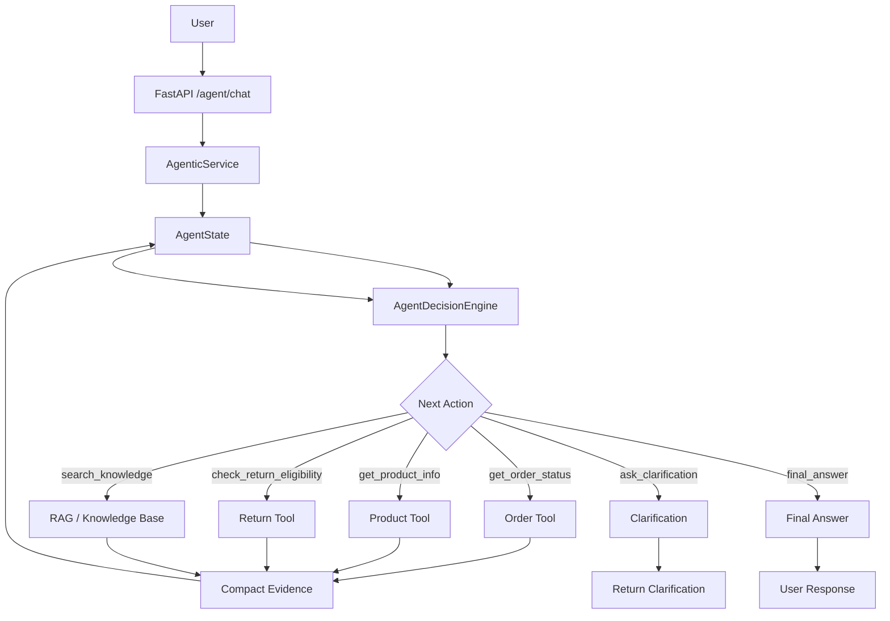

# W16 Architecture — ShopAssist AI

## 1. System Overview

W16 extends the W15 ShopAssist AI system with a bounded single-agent architecture.

The agent dynamically selects the next action based on the user query and the evidence collected from previous actions.


---

## 2. Core Agentic Loop

The central W16 behavior is an iterative decision loop.

```text
User Query
    ↓
Initialize AgentState
    ↓
AgentDecisionEngine
    ↓
Validate Decision
    ↓
Execute Selected Action
    ↓
Compact Result into Evidence
    ↓
Update AgentState
    ↓
AgentDecisionEngine
    ↓
Execute Another Action / Clarify / Finish
```

Unlike a fixed workflow, the next action is determined from the current state.

For example:

```text
User:
"Can I return ORD-1003 and what does the return policy say?"

        ↓

check_return_eligibility
        ↓
observe result
        ↓
search_knowledge
        ↓
observe result
        ↓
final_answer
```

Another request may require only one action:

```text
get_order_status
        ↓
final_answer
```

---

## 3. Component Architecture

```text
backend/
│
├── agents/
│   ├── agent.py
│   ├── evidence.py
│   ├── executor.py
│   ├── prompts.py
│   ├── schemas.py
│   └── state.py
│
├── services/
│   └── agentic_service.py
│
├── tools/
│   ├── definitions.py
│   ├── orders.py
│   ├── products.py
│   ├── returns.py
│   └── registry.py
│
├── llm/
│   └── gemini_provider.py
│
└── main.py
```

---

## 4. Component Responsibilities

### FastAPI

Provides the HTTP API.

W16 introduces:

```text
POST /agent/chat
```

The existing W15 endpoint remains available:

```text
POST /chat
```

### AgenticService

`AgenticService` is the main runtime controller.

Responsibilities:

* initialize agent state,
* invoke the decision engine,
* execute actions,
* update evidence,
* enforce iteration limits,
* handle clarification,
* handle failures,
* generate the final response,
* record token and latency information.

### AgentState

Stores the complete state of the current agent run.

Important fields include:

```text
user_query
iteration
evidence
unresolved_questions
conflicts
trajectory
sources
status
final_answer
total_tokens
total_latency_ms
```

This state allows later decisions to depend on earlier observations.

### AgentDecisionEngine

The decision engine communicates with the language model.

It receives:

* user query,
* current iteration,
* collected evidence,
* unresolved questions,
* conflicts,
* recent trajectory.

It returns a structured `AgentDecision`.

### AgentDecision Schema

The model must return:

```json
{
  "action": "get_order_status",
  "arguments": {
    "order_id": "ORD-1003"
  },
  "reason": "The order status is required to answer the user's request.",
  "confidence": 0.98
}
```

The schema restricts actions to the supported action set.

### AgentActionExecutor

The executor maps validated actions to deterministic application operations.

```text
Agent Action
     ↓
Validation
     ↓
Allowlist
     ↓
Executor
     ↓
Tool
```

The executor does not permit arbitrary model-generated functions.

---

## 5. Tool Architecture

The W16 agent can use the following tools:

```text
get_order_status
get_product_info
check_return_eligibility
search_knowledge
```

The tools are deterministic application operations.

The agent decides **when** to use them.

The tools determine **how** the operation is performed.

---

## 6. Tool Registry

The existing W15 transactional tools are registered through the tool registry.

```text
TOOL_REGISTRY
    │
    ├── get_order_status
    ├── get_product_info
    └── check_return_eligibility
```

Knowledge retrieval is invoked separately through the RAG retrieval layer.

---

## 7. Evidence Flow

Raw tool results are converted into compact observations.

```text
Tool Result
    ↓
Evidence Compaction
    ↓
Structured Observation
    ↓
AgentState.evidence
    ↓
Next Agent Decision
```

Example:

```json
{
  "facts": {
    "order_id": "ORD-1003",
    "status": "shipped"
  },
  "sources": [
    "orders.json"
  ]
}
```

This prevents unnecessary raw data from accumulating in the agent context.

---

## 8. Context Engineering

The main context-engineering technique is **structured evidence compaction**.

Instead of repeatedly passing complete raw tool outputs to the model, the system retains only the information required for subsequent decisions.

For retrieval results, the system also limits the amount of retrieved information before placing it into the agent state.

```text
Raw Retrieval
     ↓
Top-k Results
     ↓
Relevant Evidence
     ↓
Compact Observation
     ↓
Agent Context
```

This keeps the context bounded and reduces unnecessary token usage.

---

## 9. Decision Boundary

The model controls the decision layer.

```text
                 ┌──────────────────────┐
                 │       Agent          │
                 │                      │
                 │ "What should happen  │
                 │      next?"          │
                 └──────────┬───────────┘
                            │
                            ▼
                 ┌──────────────────────┐
                 │   Allowed Actions    │
                 └──────────┬───────────┘
                            │
                            ▼
                 ┌──────────────────────┐
                 │    Application       │
                 │                      │
                 │ Validate + Execute   │
                 └──────────────────────┘
```

This separation prevents the LLM from directly controlling application internals.

---

## 10. Bounded Loop

The agent uses:

```text
MAX_ITERATIONS = 6
```

The loop terminates when:

```text
final_answer
```

or:

```text
ask_clarification
```

is selected.

It also terminates on:

* fatal execution failure,
* maximum iteration count.

Therefore, the system cannot continue indefinitely.

---

## 11. Single-Agent Architecture

W16 uses a single-agent architecture.

```text
                 ┌─────────────────┐
                 │   Single Agent  │
                 └────────┬────────┘
                          │
            ┌─────────────┼─────────────┐
            │             │             │
            ▼             ▼             ▼
         Orders        Products       RAG
```

A single agent is sufficient because the task requires adaptive evidence gathering rather than independent parallel reasoning.

Using multiple agents would introduce:

* additional coordination,
* additional context passing,
* increased token usage,
* sequential bottlenecks,
* possible disagreement between agents.

The single-agent design keeps the architecture simpler while still satisfying the agentic-loop requirement.

---

## 12. Failure Handling Architecture

Tool failures are converted into structured observations.

```text
Tool
 ↓
Exception / Invalid Result
 ↓
Executor catches failure
 ↓
Structured failure observation
 ↓
AgentState
 ↓
Safe response
```

The agent is instructed not to invent information when required evidence is unavailable.

Failure cases tested include:

```text
Tool unavailable
Malformed tool response
Retrieval timeout
```

---

## 13. Clarification Flow

When required information is missing:

```text
User Query
    ↓
Agent Decision
    ↓
ask_clarification
    ↓
AgenticService
    ↓
Clarification Response
```

Example:

```text
User:
"Check my order."

Agent:
"What is the order ID you want me to check?"
```

The system does not fabricate an order identifier.

---

## 14. Final Answer Flow

When sufficient evidence has been collected:

```text
Agent
  ↓
final_answer
  ↓
Final Answer Generation
  ↓
User
```

The final response is generated from the collected evidence rather than unsupported assumptions.

---

## 15. Request Lifecycle

A complete request follows:

```text
1. User sends query
        ↓
2. FastAPI receives request
        ↓
3. AgenticService creates AgentState
        ↓
4. AgentDecisionEngine selects action
        ↓
5. Decision is schema-validated
        ↓
6. Executor runs allowed action
        ↓
7. Result is compacted into evidence
        ↓
8. AgentState is updated
        ↓
9. Agent decides again
        ↓
10. Loop continues until termination
        ↓
11. Final response returned
```

---

## 16. Observability

Each run records:

* action sequence,
* action arguments,
* decision reasons,
* confidence,
* tool results,
* evidence,
* token usage,
* latency,
* trajectory length,
* final status.

A response from `/agent/chat` therefore exposes enough information for evaluation and debugging without exposing hidden chain-of-thought.

---

## 17. Evaluation Architecture

The evaluation harness uses a deterministic mock provider.

```text
Evaluation Dataset
        ↓
Evaluation Harness
        ↓
AgenticService
        ↓
AgentDecisionEngine
        ↓
Mock Provider
        ↓
AgentActionExecutor
        ↓
Tools
        ↓
Evaluation Metrics
```

The harness evaluates:

```text
Task Completion
Tool-Call Correctness
Argument Correctness
Trajectory Length
Token Usage
Latency
Hard Failures
Soft Failures
Cascading Soft Failures
```

---

## 18. Failure Injection Architecture

Failure injection replaces normal tool behavior with controlled failures.

```text
                ┌─────────────────┐
                │ Failure Test    │
                └────────┬────────┘
                         ↓
                 AgentActionExecutor
                         ↓
              ┌──────────┼──────────┐
              ↓          ↓          ↓
          Unavailable  Malformed   Timeout
             Tool       Result    Retrieval
```

The objective is to verify that the agent fails safely instead of hallucinating missing information.

---

## 19. W15 → W16 Evolution

### W15

```text
User
 ↓
FastAPI
 ↓
Intent / RAG
 ↓
Tool or Retrieval
 ↓
Response
```

### W16

```text
User
 ↓
FastAPI
 ↓
Agent
 ↓
Decision
 ↓
Tool / RAG
 ↓
Evidence
 ↓
Agent
 ↓
Decision Again
 ↓
Tool / RAG / Clarification / Final Answer
```

The major architectural change is the introduction of a stateful, bounded decision loop.

---

## 20. Design Principles

The W16 architecture follows these principles:

1. **Dynamic action selection** — the next action depends on previous results.
2. **Bounded execution** — maximum six iterations.
3. **Deterministic tools** — business operations remain controlled by application code.
4. **Structured decisions** — model output is schema-validated.
5. **Evidence-based responses** — final answers rely on collected evidence.
6. **Context compaction** — raw results are converted into concise observations.
7. **Safe failure handling** — unavailable or malformed tools do not cause hallucinated answers.
8. **Explicit clarification** — missing information results in a clarification request.
9. **Measurable behavior** — trajectories, tokens, latency, and failures are recorded.
10. **Single-agent simplicity** — one focused agent is used instead of unnecessary multi-agent coordination.

```
